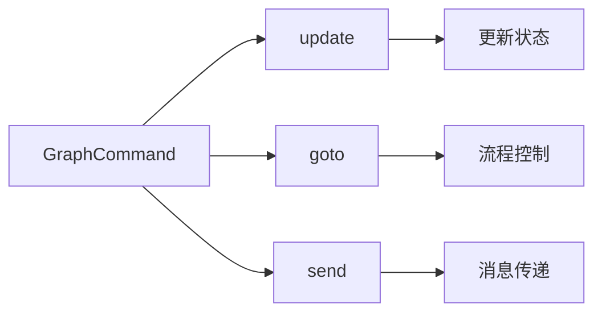
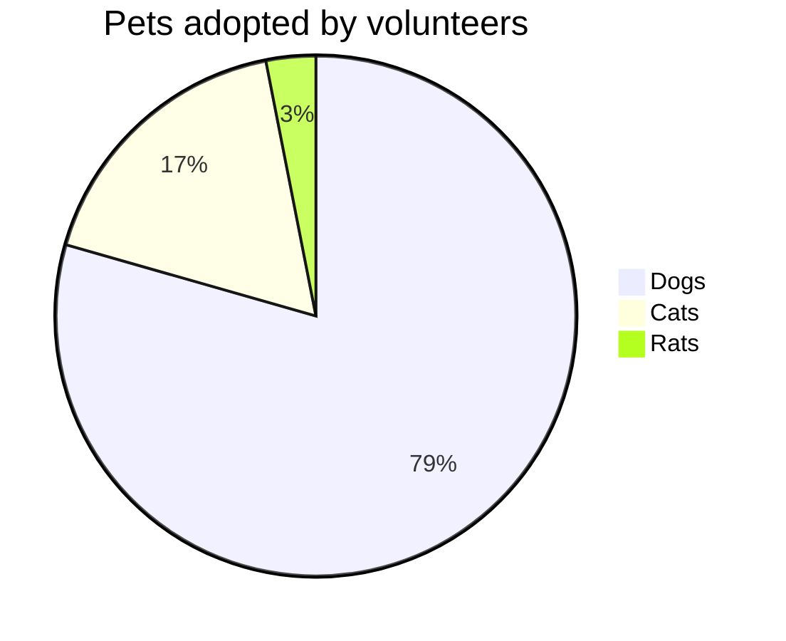

# 猫来公众号编辑器是什么？

这是一个强大的**飞书文档转换工具**，
可以帮助你快速将飞书文档转换为美观的公众号文章，并支持多种风格。

## 二级标题：Markdown 基础语法说明

### 三级标题：1. 标题：让你的内容层次分明

用 `#` 号来创建标题。标题从 `#` 开始，`#` 的数量表示标题的级别。

```markdown
# 一级标题

## 二级标题

### 三级标题
```

---

以上代码将渲染出一组层次分明的标题，使你的内容井井有条。

### 2. 段落与换行：自然流畅

Markdown 中的段落就是一行接一行的文本。要创建新段落，只需在两行文本之间空一行。

### 3. 字体样式：强调你的文字

- **粗体**：用两个星号或下划线包裹文字，如 `**粗体**` 或 `__粗体__`。
- _斜体_：用一个星号或下划线包裹文字，如 `*斜体*` 或 `_斜体_`。
- ~~删除线~~：用两个波浪线包裹文字，如 `~~删除线~~`。

---

### 4. 列表：整洁有序

- **无序列表**：用 `-` 或 `+` 加空格开始一行。
- **有序列表**：使用数字加点号（`1.`）开始一行。

在列表中嵌套其他内容？只需缩进即可实现嵌套效果。

**有序列表**

1. 有序列表项 1
2. 有序列表项 2
3. 有序列表项 3

---

### 5. 图片：丰富内容

- **图片**：和链接类似，只需在前面加上 `!`，如 ``。


轻松实现富媒体内容展示！

---

### 6. 引用：引用名言或引人深思的句子

使用 `>` 来创建引用，只需在文本前面加上它。多层引用？在前一层 `>` 后再加一个就行。

> 这是一个引用
>
> > 这是一个嵌套引用

这让你的引用更加富有层次感。如果想要突出关键词，可以使用==双等号==，让人记住重点内容。

---

### 7. 代码块：展示你的代码

- **行内代码**：用反引号包裹，如 `code`。
- **代码块**：用三个反引号包裹，并指定语言，如`js`：

```javascript
console.log("Hello, 猫来公众号编辑器");
console.log("Hello, 猫来公众号编辑器");
```

语法高亮让你的代码更易读。提示词也可以使用代码块

```markdown
给ai的提示词，需要指定语言为 md，才会换行。
```

---

### 8. 表格：清晰展示数据

Markdown 支持简单的表格，用 `|` 和 `-` 分隔单元格和表头。

|项目人员|年龄|微信号|
|--|--|--|
| `张三` |18|YLB0109|
| `李四` |20|yq2419731931|
| `王五` |22|thinkasany|

这样的表格让数据展示更为清爽！

---

## Markdown 进阶技巧

### 1. LaTeX 公式：完美展示数学表达式

Markdown 允许嵌入 LaTeX 语法展示数学公式：

- **行内公式**：用 `$` 包裹公式，如 $E = mc^2$。
- **块级公式**：用 `$$` 包裹公式，如：

```markdown
$$
\sum_{i=1}^n i = \frac{n(n+1)}{2}
$$
```

效果：
$$
\sum_{i=1}^n i = \frac{n(n+1)}{2}
$$

---

### 2. Mermaid 流程图：可视化流程

Mermaid 是强大的可视化工具，可以在 Markdown 中创建流程图、时序图等。

**流程图**



---

**饼状图**



> 更多用法，参见：[Mermaid 官方文档](https://mermaid.js.org/intro/getting-started.html)。

---

## 结语

猫来编辑器兼容了全量的markdown语法，可以直接复制 deepseek 等ai大模型的回答，直接转成美观的知识卡片。

### 推荐阅读

- [新手小白，两周时间，学会用cursor+cloudflare做AI网站](https://flowus.cn/maolai/share/0e01031d-6673-451e-818f-d00d9edccefe?code=YZKEEV)
- [AI提示词-学习手册](https://flowus.cn/maolai/share/df24506e-ea60-4c76-8ec8-cc7ac7acc953?code=YZKEEV)
